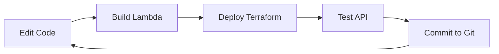

# 📋 Project Summary: Personal Knowledge Base API

## 🎯 What You've Built

A complete **serverless REST API** for managing personal knowledge items (notes, bookmarks, tasks) using:

✅ **AWS Lambda** - Serverless compute for API functions  
✅ **API Gateway** - RESTful API endpoints  
✅ **DynamoDB** - Serverless NoSQL database  
✅ **Docker** - Containerization for local development  
✅ **Kubernetes** - Container orchestration manifests  
✅ **Terraform** - Infrastructure as Code (IaC)  
✅ **Git** - Version control  

## 🏗️ Architecture Overview

```
┌─────────────────┐
│   Frontend      │  Simple HTML/JS interface
│  (index.html)   │
└────────┬────────┘
         │ HTTPS
         ▼
┌─────────────────┐
│  API Gateway    │  REST API (GET, POST, DELETE)
│   (AWS)         │
└────────┬────────┘
         │
         ▼
┌─────────────────┐
│   Lambda        │  Python 3.9 Functions
│   Functions     │
│  (get/create/   │
│   delete-item)  │
└────────┬────────┘
         │
         ▼
┌─────────────────┐
│   DynamoDB      │  NoSQL Database
│  (AWS)          │
└─────────────────┘
```

## 📁 Project Structure Explained

```
serverless_app/
├── README.md                          # Main documentation
├── QUICKSTART.md                      # Quick start guide
├── PROJECT_SUMMARY.md                 # This file
├── .gitignore                         # Git ignore patterns
│
├── lambda-functions/                  # Lambda function code
│   ├── get-items/
│   │   ├── lambda_function.py        # List all items
│   │   └── requirements.txt           # Dependencies
│   ├── create-item/
│   │   ├── lambda_function.py        # Create new item
│   │   └── requirements.txt
│   └── delete-item/
│       ├── lambda_function.py        # Delete item
│       └── requirements.txt
│
├── infrastructure/                    # Terraform infrastructure
│   ├── main.tf                        # Main Terraform config
│   ├── variables.tf                   # Input variables
│   ├── outputs.tf                     # Output values
│   └── terraform.tfvars.example       # Example config
│
├── docker/                            # Docker configuration
│   ├── Dockerfile.lambda              # Lambda container image
│   └── docker-compose.yml             # Multi-container setup
│
├── kubernetes/                        # K8s manifests
│   ├── api-deployment.yaml           # Pod deployment
│   └── api-service.yaml               # Service definition
│
├── frontend/                          # Web interface
│   └── index.html                     # Single-page app
│
└── scripts/                           # Helper scripts
    ├── setup.sh                       # Initial setup
    ├── build-lambda.sh               # Package Lambda functions
    └── deploy.sh                      # Deploy to AWS
```

## 🛠️ Technologies Used

### AWS Services
- **Lambda**: Python 3.9 runtime for serverless functions
- **API Gateway**: REST API with HTTP methods
- **DynamoDB**: Serverless NoSQL database
- **IAM**: Roles and policies for security

### Infrastructure
- **Terraform**: Infrastructure as Code
- **Docker**: Containerization
- **Kubernetes**: Container orchestration (minikube/kind)

### Development
- **Python 3.9**: Lambda runtime
- **boto3**: AWS SDK for Python
- **Git**: Version control

## 📝 API Endpoints

| Method | Endpoint | Description |
|--------|----------|-------------|
| GET | `/items` | List all knowledge items |
| POST | `/items` | Create a new item |
| DELETE | `/items/{id}` | Delete an item by ID |

### Request/Response Examples

**GET /items**
```bash
curl https://api-url/prod/items
# Response: {"items": [...], "count": 2}
```

**POST /items**
```bash
curl -X POST https://api-url/prod/items \
  -H "Content-Type: application/json" \
  -d '{"title":"Learn AWS","content":"Study Lambda","type":"note"}'
```

**DELETE /items/{id}**
```bash
curl -X DELETE https://api-url/prod/items/uuid-here
```

## 🚀 Getting Started (Choose Your Path)

### Path 1: Deploy to AWS (Recommended)
1. Configure AWS: `aws configure`
2. Build functions: `./scripts/build-lambda.sh`
3. Deploy: `cd infrastructure && terraform apply`
4. Get URL: `terraform output api_gateway_url`
5. Test API with curl or frontend

### Path 2: Local Docker Testing
1. Build: `cd docker && docker-compose build`
2. Run: `docker-compose up`
3. Test: `curl http://localhost:9001`

### Path 3: Kubernetes Testing
1. Start cluster: `minikube start`
2. Deploy: `kubectl apply -f kubernetes/`
3. Check: `kubectl get pods`

## 💰 AWS Costs (Estimated)

This is a **serverless architecture** - you pay only for what you use:

- **API Gateway**: Free tier (1M requests/month free)
- **Lambda**: Free tier (1M requests, 400K GB-seconds free)
- **DynamoDB**: Free tier (25 GB storage, 25 RCU/WCU)
- **Total**: ~$0 for light usage (< 1 million requests/month)

## 🎓 Learning Outcomes

By completing this project, you've learned:

1. **Serverless Architecture**
   - AWS Lambda function creation
   - Serverless database with DynamoDB
   - API Gateway integration

2. **Infrastructure as Code**
   - Terraform providers and resources
   - State management
   - Variables and outputs

3. **Containerization**
   - Docker multi-stage builds
   - Docker Compose orchestration
   - Kubernetes deployments

4. **DevOps Practices**
   - Git version control
   - Automation scripts
   - Deployment workflows

## 🔄 Development Workflow



1. **Make changes** to Lambda functions
2. **Package**: `./scripts/build-lambda.sh`
3. **Deploy**: `terraform apply`
4. **Test**: Use curl or frontend
5. **Commit**: `git commit && git push`

## 🎯 Next Steps & Enhancements

### Quick Wins
- [ ] Add update endpoint (PUT /items/{id})
- [ ] Add search/filter functionality
- [ ] Add file attachments (S3 integration)
- [ ] Add item categories/tags

### Medium Complexity
- [ ] Add user authentication (AWS Cognito)
- [ ] Add API rate limiting
- [ ] Add CloudWatch dashboards
- [ ] Add unit tests for Lambda functions

### Advanced Features
- [ ] Implement CI/CD pipeline (GitHub Actions)
- [ ] Add monitoring and alerting
- [ ] Add backup/restore functionality
- [ ] Multi-region deployment
- [ ] Add GraphQL API layer

## 📚 Resources

- [AWS Lambda Python Docs](https://docs.aws.amazon.com/lambda/latest/dg/lambda-python.html)
- [Terraform AWS Provider](https://registry.terraform.io/providers/hashicorp/aws/latest/docs)
- [Docker Best Practices](https://docs.docker.com/develop/dev-best-practices/)
- [Kubernetes Tutorials](https://kubernetes.io/docs/tutorials/)

## 🐛 Troubleshooting Checklist

- [ ] AWS credentials configured: `aws sts get-caller-identity`
- [ ] Terraform initialized: `terraform init`
- [ ] Lambda functions packaged: `ls lambda-functions/*/function.zip`
- [ ] DynamoDB table exists: `aws dynamodb list-tables`
- [ ] API Gateway deployed: `terraform output`
- [ ] IAM permissions correct (check CloudTrail logs)

## 🎉 Congratulations!

You now have a production-ready serverless application that:
- Scales automatically
- Costs almost nothing at low usage
- Can be deployed with one command
- Follows infrastructure as code best practices

Happy coding! 🚀

